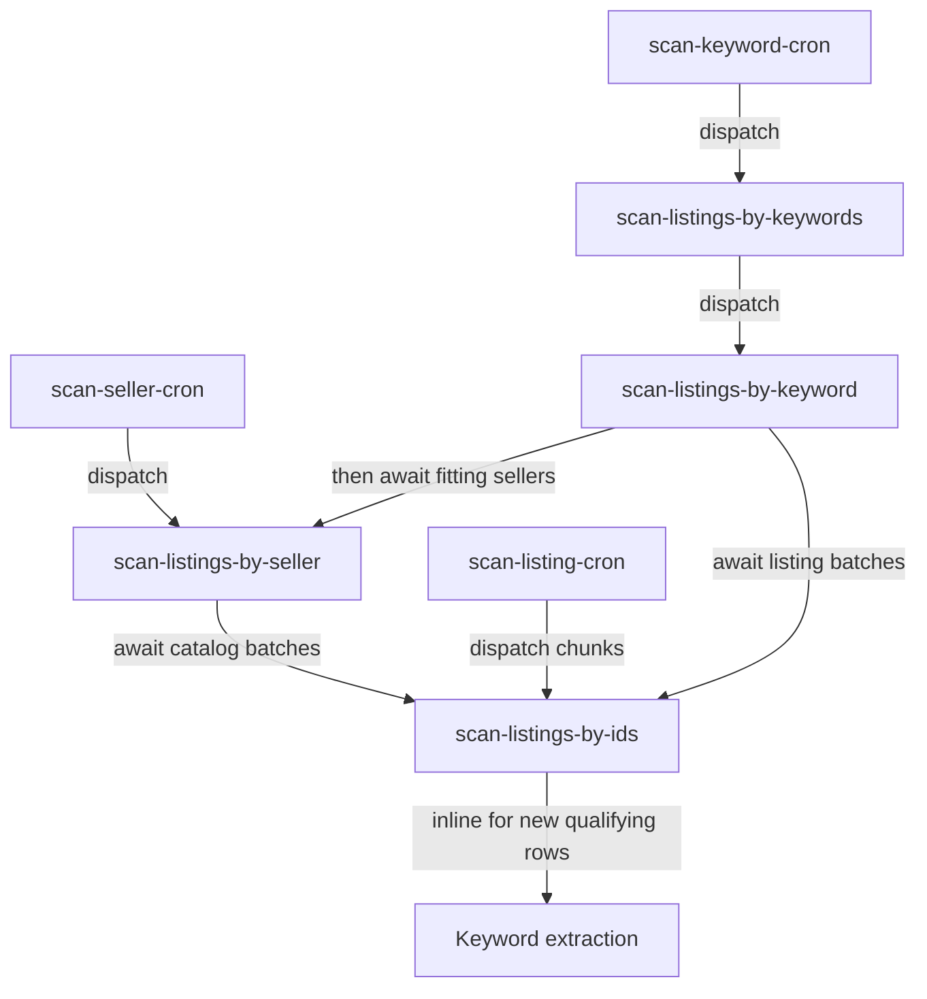

# Scan architecture

The explorer scans unofficial marketplace APIs through `@dashseller/marketplace-scan`.
Workflows live in `src/workflows/scan`, database operations in `src/nodes/scan`, and
shared orchestration helpers in `src/utils`. eBay supports all three scan entities;
shop supports listing detail only. Capability checks precede persona acquisition.

## Task structure and completion

Cron and bulk intake complete after dispatch. For listing, seller, and keyword
scans, `run.ok` means all required work completed. Parent success variants are
`completed`, `skipped/fresh`, and seller-only `skipped/seller-gone`. An in-flight
dependency throws `ScanIncompleteError`; it cannot satisfy a parent's completion.

Callers chunk listing IDs by `scan_config.listingScanBatchSize` (K). Leaves always
process sequentially and never launch themselves. A manual payload larger than K
logs a warning and remains one paced run. All batch API calls split at 1,000 items;
empty inputs never create a batch. `waitForListingBatches` collects successful
siblings even when other children fail.

Keywords register their input before failure-prone work, walk the configured search
depth, partition fresh listings, await stale listing batches, and then await sellers
from fitting fresh or successful child verdicts. Sellers fetch stats and walk the
catalog to exhaustion before awaiting stale listing chunks. The seller safety cap
of 1,000 pages is incomplete when the last page still reports more. A failed page
leaves already-discovered IDs available for downstream validation. Healthy siblings
finish before parents throw. Parent `last_scanned_at` advances only after complete
coverage; updating seller stats alone does not mark its catalog scanned.

## Freshness

Cooldowns in [scan-cooldowns.ts](../src/utils/scan-cooldowns.ts) are shared by cron,
parents, and leaves:

| Entity | Cooldown | Timestamp means |
| --- | --- | --- |
| Listing | 6 hours | Completed full scan saved (`scan_listing.last_scanned_at`) |
| Seller | 24 hours | Stats and catalog checks complete, or confirmed seller gone |
| Keyword | 7 days | Configured search and all required listing/seller work complete |

Freshness checks include marketplace identity. Parents prefilter before enqueueing;
leaves check again before loading a persona. `forceRefresh` bypasses only the
keyword/seller parent's freshness gate; listing freshness still applies.

New listings must have titles and pass the current thresholds. Existing listings
retain valid full observations even below thresholds. Invalid titles or partial
variant sets fail the scan without changing current data/history. Stored metrics
are re-evaluated against current thresholds while fresh; reused verdicts perform
no write, snapshot, HTTP request, or inline extraction. Listing-detail 404s complete
the current check but create no negative-cache row and do not delete existing data.

Inline LLM extraction runs only for newly inserted qualifying listings, using ID
and title. Phrases enter the independent keyword pool; extraction does not link or
update listings, track attempts, or support manual catch-up. Failures never fail a scan.

Current values and listing sales history follow the
[listing observation contract](../../../.agents/knowledge-base.md#listing-observations).
Each saved full scan atomically updates the listing and current variants and
appends one listing sales snapshot, even when counters are unchanged. Its save
timestamp is shared by listing `last_scanned_at`, observed/changed variant `updated_at`,
and snapshot `created_at`. Failed scans and cache hits change none of these.
There is no sequence or scan-start tracking; overlapping completed scans can
both save under a row lock, with the last transaction determining current values.

Task verdicts contain only qualifying listings and carry no `fit` or `persisted`
flag. `isNew` controls first-time keyword extraction. Below-threshold existing
listings can record history without appearing in returned verdicts.

## Best-effort duplicate suppression

[scan-in-flight.ts](../src/utils/scan-in-flight.ts) iterates every `runs.list` page
and filters QUEUED, DEQUEUED, EXECUTING, WAITING, DELAYED, and PENDING_VERSION.
One tag is filtered server-side; additional tags are checked on each result.

| Tag | Purpose |
| --- | --- |
| `marketplace_<marketplace>` | Isolate marketplaces |
| `scan_keyword_<reference>` / `scan_seller_<reference>` | Identify parent work |
| `scan_source_cron` | Suppress overlapping cron listing sweeps |

Entity tags exceeding 128 characters are omitted with a warning, never truncated.
Those inputs still execute and remain registered, with weaker suppression.
Startup compares `(createdAt, id)` to find an older sibling. Finding one throws
`ScanIncompleteError` with reason `in-flight` and its ID. Startup lookup failure
performs the full scan. There are no launch keys, priorities, polling loops, or
adoption of older runs' terminal outcomes. Visibility lag can allow duplicate
execution; freshness checks are not atomic claims.

Keywords treat sellers found running before launch, and duplicate children that
fail as in-flight, as deferred dependencies. After other work finishes, freshness
is rechecked. Still-stale sellers cause failure without advancing the keyword.
Seller lookup failure also leaves coverage unresolved. Deferred references are
error details/metadata, not a success counter.

Bulk and singular keyword intake share conflict-safe registration: missing rows
start `source = manual`, `last_scanned_at = NULL`; existing source, timestamps,
and retirement state are preserved. Bulk lookup and dispatch failures throw so
SDK retries can recover; exhausted attempts leave cron-eligible rows. Cron may
skip one sweep as `in-flight-unknown` and continue because its inputs already exist.

## Error and retry policy

[scan-errors.ts](../src/utils/scan-errors.ts) owns classification and retry delay.

| Outcome | Leaf / parent behavior |
| --- | --- |
| Exact marketplace listing-detail 404 | Count `notFound`; complete that check |
| Exact seller-detail 404 | Persist bare seller if needed; stamp; `seller-gone` |
| Listing parse/other failure | Finish healthy IDs and extraction, then `ListingBatchError` |
| Persona-level 401/403/429/5xx | Route once; stop further requests on that persona; finish usable downstream work; throw |
| Profile deleted by admin (a worker write matches no row) | Throw `StaleMobileProfileError`; stop using that persona; retry after 20 minutes with a fresh load |
| In-flight dependency only | `ScanIncompleteError(in-flight)`; retry after 20 minutes |
| Failed child, lookup, pagination | Throw; leave parent stale |

Leaves retain four attempts and OOM escalation from micro to small-1x. Parents
retain three attempts. Persona-level request failures retry after 20 minutes,
longer than the 15-minute cooldown. Other errors use the task's normal backoff.
After attempts are exhausted, scans remain visibly failed and stale for recovery.
Successful leaf output includes `mode: scanned`, `triggered`, `fresh`, `scanned`,
`notFound`, and qualifying `verdicts`; no successful output represents an abort.
Fresh/scanned counts include completed nonqualifying checks, even though these
listings are omitted from verdicts. There is no `unfit` output count.

## Persona selection and queues

The manager identifies the worker using the boxinfo sidecar and loads the active,
non-cooling profile whose `assigned_worker` equals the box hostname. A box that owns
no row for the app claims the lowest-numbered unassigned active one in a single
`UPDATE … WHERE id = (SELECT … FOR UPDATE SKIP LOCKED)` statement
(`packages/db/src/lib/mobile-profile-claim.ts`); the unique index on
`(app, assigned_worker)` keeps one row per box. A box whose row is dead or cooling
never takes a second one. Bearer mint/refresh and encrypted storage are described in
[token storage](../../../.agents/rules/data-adapter-token-storage.md).

Worker identity is discovered afresh from `boxinfo` whenever it is needed. Trigger
checkpoints preserve task memory and may restore a run on another worker, so keyword
and seller tasks run `resumeScanSession` in `onResume`: it invalidates the run-scoped
scan session, clears the `profileId` metadata, reads the box name again, and fails
closed if the new identity cannot be discovered. The next marketplace request lazily
loads or claims that worker's profile and rebuilds the complete client, including
device credentials and its bearer provider. Metadata and logs record worker names and
profile IDs only, never credentials or tokens.

Database sockets do not survive a restore either. The worker builds its client in
`utils/db.ts` from the deployment env (`createDbClient` from `@dashseller/db/client`),
tuned for checkpointing (`max: 1`, `idleTimeoutMillis: 10_000`) so an idle connection
closes on its own before a checkpoint instead of being carried across the restore.
`createDbClient` always
registers a pool `error` listener: an idle client that dies is dropped by `pg-pool`
and logged instead of killing the process with an uncaught exception, and the next
query opens a fresh connection. Nothing is rotated or drained on resume. API and app
processes keep the pg defaults.

Keyword, seller, and cron orchestration queues remain separate. Each of the three
entity crons has its own queue (`scan-cron-keyword`, `scan-cron-seller`,
`scan-cron-listing`) capped at concurrency 1, so a cron never overlaps itself but
the three sweeps can run concurrently; keyword, seller, and listing leaves have no
cap and run at the environment limit. Throughput is therefore bounded by the live persona pool,
not by the queues: runs that land on the same box share that box's one
`mobile_profile`, so a box can drive its persona with more than one run at a time.
Persona failure bookkeeping is last-write-wins (`markSoftFailure` computes the next
`failure_count` in memory, and admin status changes and failure resets are not fenced
against it), so overlapping runs on one persona can lose failure counts and delay
cooldown or dead promotion. Each leaf processes its IDs sequentially;
this does not establish physical placement or request serialization across runs.

Each cron queries visible in-flight work for its entity and removes busy references from its selected
batch before dispatch. Selection orders stale rows by listing `last_scanned_at` or
seller/keyword `last_scanned_at`, then `id ASC`. It includes never-scanned
seller/keyword rows, filters retired
keywords, and isolates marketplaces. Suppressed rows can consume the selection
budget until the later fairness stage moves exclusion before SQL LIMIT and caps
first scans. Overlapping cron listing sweeps are suppressed while earlier cron
leaves are nonterminal. Freshness and run lookup are not atomic work claims.

## Deployment prerequisites

Do not assume waiting releases a machine or queue slot, or stops `maxDuration`
accounting. The official [self-hosting feature table](https://trigger.dev/docs/self-hosting/overview#feature-comparison)
excludes checkpoints and warm starts. Record the deployed server version and test
checkpointing, resource release, duration accounting, run visibility, and queue
progress with real waiting parents. Measure warm-start behavior separately.
Full production fan-out remains gated on these checks and all three stages. See
[rollout](scan-cron-rollout.md) and [payload reference](task-payloads.md).
